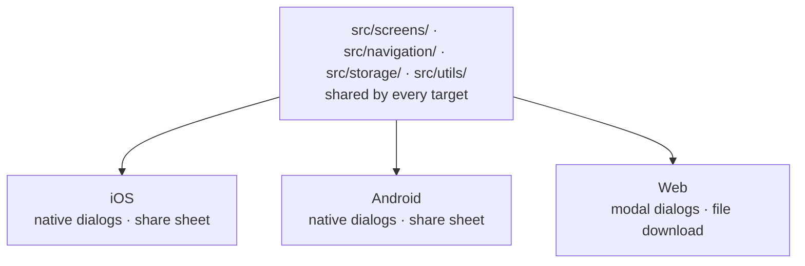

<div align="center">

# TrackFitness

**Log the set. See the progress. Own your data.**

A dark-themed workout tracker that runs as an iOS app, an Android app, and a website — from one codebase.

[](https://github.com/keyurhindocha/TrackFitness/actions/workflows/deploy-web.yml)

**[Open the live app →](https://keyurhindocha.github.io/TrackFitness/)**

</div>

---

Most fitness apps want an account, a subscription, and a copy of your training
history on someone else's server. TrackFitness wants none of that. It opens
straight to your last session, logs a set in about four taps, and keeps every
byte on the device you typed it into.

No sign-up. No network calls. No analytics. Just the barbell and the numbers.

---

## Contents

- [One codebase, three targets](#one-codebase-three-targets)
- [Features](#features)
- [The app, screen by screen](#the-app-screen-by-screen)
- [Quick start](#quick-start)
- [Shipping the website](#shipping-the-website)
- [Installing on a phone](#installing-on-a-phone)
- [Architecture](#architecture)
- [Data model](#data-model)
- [Tech stack](#tech-stack)
- [Gotchas](#gotchas)
- [Roadmap](#roadmap)

---

## One codebase, three targets

TrackFitness is an **Expo** app. That has not changed — the web build is a third
destination, not a rewrite. The same React Native screens compile to native iOS,
native Android, and a static website, because `react-native-web` maps
`<View>` and `<Text>` onto `<div>` and `<span>` at build time.

| Target | Command | What you get |
| --- | --- | --- |
| **iOS** | `npm run ios` | A native app from the `ios/` Xcode project |
| **Android** | `npm run android` | A native app via Gradle |
| **Web** | `npm run build:web` | A static site in `dist/`, hostable anywhere |

Roughly 4,700 lines of screens, navigation, storage and theming are shared
verbatim across all three. Only two behaviours genuinely differ per platform,
and both are isolated behind a single import each:



The seam is deliberate: screens never branch on `Platform.OS` for these. They
call `showAlert()` and `saveBackup()`, and the right implementation is resolved
at build time.

---

## Features

**Training**

- Log a workout as exercises → sets → `reps × weight`
- Edit or delete any past session
- Autocomplete that merges a built-in exercise list with everything you have logged
- History grouped by date, expandable session by session

**Progress**

- Per-exercise trend lines drawn from your own history
- Best weight and total session count for every movement
- A full month calendar showing exactly which days you trained

**Nutrition, honestly**

- A cheat log with quick tags — Cookie, Cake, Chocolate, Ice Cream
- Per-day entries you can review on the same calendar view

**Your data**

- `lbs` ⇄ `kg` switching that converts every stored weight in place
- Export the whole database to a JSON file
- Import it back on any platform
- Stored locally. Always.

---

## The app, screen by screen

### Workouts

The landing tab and the one you will live in. Sessions are grouped into date
sections, newest first; tap any card to expand its exercises and sets. **Start
Workout** opens an empty log for today, and the gear in the header leads to
data and backup settings.

### Log Workout

Add exercises, then add sets to each. Weight and reps are numeric inputs with a
keyboard accessory bar on iOS so you can dismiss the pad one-handed mid-set.
Opening an existing session turns the screen into **Edit Workout** — same form,
same code path.

### Progress

Every exercise you have ever logged, each with an inline sparkline of its weight
over time. Tap one for the detail view: a full line chart, **Best Weight**,
**Sessions**, and a complete **History** list.

### Calendar

A month grid with training days marked. Select a day to see what you actually
did; empty days read *"Rest day — no workout logged"*, which is its own kind of
feedback.

### Cheat Log

The counterweight. Add what you ate, tag it, review it by date. No calories, no
macros, no lecture — just a record of the treats so the pattern is visible.

### Data & Backup

Counts of everything stored, the unit selector, and the export/import pair. The
unit switch is not cosmetic: flipping to `kg` rewrites every stored weight
through a conversion pass, so your history stays internally consistent.

---

## Quick start

**Prerequisites** — [Node.js](https://nodejs.org/) 20 or newer, and npm.

```bash
git clone https://github.com/keyurhindocha/TrackFitness.git
cd TrackFitness
npm install
```

### Run it

```bash
npm start           # Expo dev server — scan the QR code with Expo Go
npm run web         # web dev server in your browser
npm run ios         # build and run the native iOS app (macOS + Xcode)
npm run android     # build and run the native Android app
```

The fastest path to your own phone is `npm start` plus the **Expo Go** app —
every dependency here is Expo Go compatible, so no Mac or Xcode is required.

### All scripts

| Script | What it does |
| --- | --- |
| `npm start` | Expo dev server for native targets |
| `npm run web` | Web dev server with fast refresh |
| `npm run ios` | Native iOS build and run |
| `npm run android` | Native Android build and run |
| `npm run build:web` | Static site export into `dist/` |
| `npm run serve:web` | Serve the built `dist/` locally |

---

## Shipping the website

`npm run build:web` produces a fully static `dist/` — HTML, one JS bundle, and
assets. No server, no runtime, no environment variables. Anything that can serve
a folder can host it.

### GitHub Pages (already wired)

`.github/workflows/deploy-web.yml` builds and publishes on every push to `main`.
It sets the base URL from the repository name, writes `.nojekyll`, and copies
`index.html` to `404.html` as a single-page-app fallback.

> **One-time setup:** Pages must be enabled by hand at
> **Settings → Pages → Source → GitHub Actions**. The workflow's own token is
> not permitted to create the site, so the first run fails with
> `Get Pages site failed` until this is set.

### Netlify, Vercel, Cloudflare Pages

| Setting | Value |
| --- | --- |
| Build command | `npm run build:web` |
| Publish directory | `dist` |

### Base URL

Hosts that serve from a sub-path need the asset prefix baked in at build time.
`app.config.js` reads it from the environment:

```bash
# GitHub Pages, served from /TrackFitness/
EXPO_WEB_BASE_URL=/TrackFitness npm run build:web

# Netlify / Vercel / Cloudflare, served from the domain root
npm run build:web
```

---

## Installing on a phone

### As a web app

Open the [live site](https://keyurhindocha.github.io/TrackFitness/) in Safari or
Chrome, then **Share → Add to Home Screen**. It launches standalone — no browser
chrome, its own icon, indistinguishable from a native app at a glance.

`public/` carries what makes that work: an `apple-touch-icon`, a web manifest,
and the `apple-mobile-web-app-*` meta tags. iOS ignores `<link rel="icon">` when
installing, so without the touch icon Safari draws a plain letter tile instead.

> iOS caches home-screen icons per URL. If you change the artwork, delete the
> shortcut and re-add it — an existing one keeps the old image forever.

### As a native app

`npm run ios` with a device attached, or `eas build` for TestFlight. A free
Apple ID works for personal installs but the build expires after seven days;
a paid Developer Program membership extends that to a year.

---

## Architecture

```text
.
├── App.js                      # providers, splash gate, navigation root
├── app.json                    # Expo config: native, web, PWA metadata
├── app.config.js               # injects EXPO_WEB_BASE_URL at build time
├── ios/                        # native iOS project (Xcode)
├── public/                     # web template, favicon, PWA icons, manifest
│   ├── index.html              #   HTML template Expo builds from
│   └── manifest.webmanifest
├── src/
│   ├── components/
│   │   └── AlertHost.js        # cross-platform confirmation dialogs
│   ├── context/
│   │   └── UnitContext.js      # lbs/kg preference + conversion
│   ├── navigation/
│   │   └── AppNavigator.js     # bottom tabs + two native stacks
│   ├── screens/                # one file per screen
│   ├── storage/
│   │   └── storage.js          # the entire persistence layer
│   └── utils/
│       ├── backup.js           # native: share sheet + document picker
│       ├── backup.web.js       # web: blob download + file input
│       ├── helpers.js          # dates, ids, formatting
│       └── theme.js            # colours, layout, shadows
└── .github/workflows/
    └── deploy-web.yml          # build and publish to GitHub Pages
```

### Navigation

A bottom tab navigator with four tabs — **Workouts**, **Progress**,
**Calendar**, **Cheat Log**. Workouts and Progress each wrap a native stack, so
Log Workout, Settings and Progress Detail push over their parent tab rather than
replacing the tab bar.

### The platform seam

Two things have no browser equivalent, and both are solved by file resolution
rather than runtime branching. Metro picks `.web.js` automatically when
bundling for web.

**Backups** — `backup.js` writes a cache file and opens the OS share sheet.
`backup.web.js` builds a `Blob`, triggers a download, and reads imports through
a hidden `<input type="file">`. Screens import from `../utils/backup` and never
learn which one they got.

**Dialogs** — `react-native-web` ships `Alert.alert` as a *no-op stub*. It does
not throw; it silently does nothing, which would have made every delete
confirmation quietly fail. `AlertHost.js` keeps the native dialog on iOS and
Android and renders a themed modal on web, behind one `showAlert()` call with
the same signature as `Alert.alert`.

### Theming

`src/utils/theme.js` is the single source of truth — near-black surfaces
(`#0a0a0a` → `#222`), a burnt-orange accent (`#ff6b35`), and semantic colours
for success, danger and highlight. No screen hardcodes a hex value.

---

## Data model

Everything lives in AsyncStorage under a small set of keys:

| Key | Holds |
| --- | --- |
| `@trackfitness_workouts` | Every logged session |
| `@trackfitness_cheat_days` | Cheat log entries by date |
| `@trackfitness_goals` | Goal definitions |
| `@trackfitness_unit` | `"lbs"` or `"kg"` |
| `@trackfitness_favorites` | Reserved — defined, not yet used |

A workout is deliberately boring, which is what makes it portable:

```json
{
  "id": "k2p9x4m1a",
  "date": "2026-09-07",
  "exercises": [
    {
      "name": "Bench Press",
      "sets": [
        { "reps": 8, "weight": 135 },
        { "reps": 6, "weight": 155 }
      ]
    }
  ]
}
```

A cheat day pairs a date with tagged items:

```json
{
  "id": "b7c2n8k4d",
  "date": "2026-09-07",
  "items": [{ "text": "Two cookies", "tag": "cookie" }]
}
```

### Where your data actually lives

On iOS and Android, in the app's private storage. On the web, in the browser's
`localStorage` for that origin. It never leaves the device, because there is
nowhere for it to go.

The flip side of that guarantee is that **nothing syncs**:

- The native app and the website are separate stores.
- On iOS, a home-screen install gets its **own storage container, separate from
  Safari**. Workouts logged in the Safari tab do not appear in the installed
  app. Pick one and stay in it.
- Clearing website data deletes the history.

**Data & Backup → Export to JSON** is the answer to all three. It is also the
only way to move existing history between platforms, and it is worth running
every so often on principle.

---

## Tech stack

| | |
| --- | --- |
| **Framework** | Expo SDK 54, React Native 0.81, React 19.1 |
| **Web** | `react-native-web` 0.21, Metro, static export |
| **Navigation** | React Navigation 6 — bottom tabs + native stack |
| **Storage** | `@react-native-async-storage/async-storage` |
| **Charts** | `react-native-chart-kit`, `react-native-svg` |
| **Calendar** | `react-native-calendars` |
| **Icons** | `@expo/vector-icons` (Ionicons) |
| **CI/CD** | GitHub Actions → GitHub Pages |

---

## Gotchas

Things that cost real time to work out, recorded so they cost no more.

**`expo-file-system` v19 moved the classic API.** `cacheDirectory`,
`EncodingType`, `writeAsStringAsync` and `readAsStringAsync` now live behind
`expo-file-system/legacy`. Importing them from the package root throws at
runtime. `src/utils/backup.js` imports from `/legacy` for exactly this reason.

**`Alert.alert` is a silent no-op on web.** See
[the platform seam](#the-platform-seam). This one is dangerous precisely
because nothing crashes.

**GitHub Pages needs `.nojekyll`.** The JS bundle is emitted to `_expo/`, and
Jekyll strips directories beginning with an underscore. Without that file the
site deploys and then loads nothing at all.

**`useNativeDriver` warns in browsers.** There is no native animated module on
web, so the splash animation sets it from `Platform.OS`.

**Icons and manifest use relative paths.** That is what lets the identical build
work at a domain root and under `/TrackFitness/`.

---

## Roadmap

- [ ] **Goals** — the storage layer and a full screen exist but are not yet
      wired into navigation
- [ ] Search and filtering across workout history
- [ ] Rest timer between sets
- [ ] Optional cloud sync, for people who want it
- [ ] Richer nutrition tracking

---

<div align="center">

Built with [Expo](https://expo.dev/). Runs everywhere. Owned by you.

</div>
